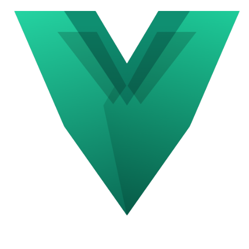

  

  
  

---

Ingeniero Electronico (UIS, acreditada ABET) con +4 anos en IA/ML y +10 en tecnologia. Construyo sistemas de inteligencia artificial que llegan a produccion — plataformas documentales con LLMs en entornos air-gapped sobre GPUs NVIDIA H200, pipelines RAG, modelos de ML entrenados desde cero, y 3 productos SaaS propios en produccion. Lidero equipos tecnicos y diseno arquitecturas que escalan.

---

## Productos en produccion

<table>
  <tr>
    <td align="center" width="50%">
        
      <a href="https://verboxi.com"><strong>verboxi.com</strong></a> 
      Tutor de ingles con IA conversacional. Streaming SSE con TTS paralelo (latencia menor a 2s), gamificacion completa (XP, streaks, 18 badges, SRS), pagos recurrentes con Wompi.
    </td>
    <td align="center" width="50%">
        
      <a href="https://deplorix.com"><strong>deplorix.com</strong></a> 
      Generacion de documentos profesionales con IA. Multi-proveedor LLM (OpenAI, DeepSeek, Cloudflare AI), pipeline auto-fix de 5 intentos, edicion inteligente por secciones.
    </td>
  </tr>
</table>

---

## Stack tecnologico

**IA / Machine Learning**

**Cloud y Serverless**

**Infraestructura**

**Desarrollo**

**Datos**

---

## Trabajo destacado

### Modelos de ML propios

**Hit Song Predictor** — Modelo ensemble (MLP + CNN + XGBoost) entrenado desde cero sobre 83 features de audio extraidas con librosa + espectrogramas mel 128x128 para la CNN. 74.2% de accuracy prediciendo exito de canciones usando solo audio, sin metadata de Spotify. Desplegado en AWS Lambda con inferencia en tiempo real.

**Sistema de recomendacion musical** — Modelos entrenados sobre +5M registros de artistas. Indexacion de +450,000 perfiles en OpenSearch con busquedas en menos de 50ms. Endpoints de inferencia en FastAPI en menos de 100ms.

### Sistemas de IA empresariales

**Plataforma de inteligencia documental** — Para el sector defensa de Colombia. LLMs locales desplegados on-premise en entornos air-gapped sobre 4x NVIDIA H200 GPUs, pipeline RAG con pgvector, streaming SSE, orquestacion en Kubernetes (K3s). Rescate de un sistema de 2.3M documentos en cluster de 6 nodos tras falla catastrofica de almacenamiento — 99.5% uptime post-estabilizacion.

**Plataformas de IA gubernamentales** — RAG multi-proveedor (OpenAI, Azure OpenAI, Ollama, vLLM), prototipos para entidades de seguridad, encuestas ISO 9001, gestion interna.

**Scraper de gran escala** — Ingestion de +10M registros de +75 emisoras de radio en OpenSearch y S3.

### Mega Pipeline de audio (ConcertPlaza)

Pipeline completo: Whisper transcribe la letra, GPT la mejora con feedback de 3 agentes expertos IA (productor, ingeniero de mezcla, letrista), GPT construye prompt inteligente para Suno usando hit score + diagnostico + recomendaciones, Suno genera la cancion, Demucs separa stems, y se mezclan 2 versiones finales con los instrumentales mejorados. Todo orquestado en una sola Lambda de 15 minutos.

---

## Trayectoria

**BIT512 Soluciones TI** — Lider de IA / Ingeniero Senior de IA *(2025 - presente)*
10+ proyectos: Eclipse, JANUS, Hydra, Nexus, Sortex, Compensar HCM, plataformas gubernamentales.

**IncubApp Venture Capital** — AI Technical Project Manager *(2024 - 2025)*
Proyectos de IA para startups del portafolio. 100% de entregas a tiempo.

**IncubApp Venture Capital** — Data Scientist y ML Engineer *(2021 - 2024)*
Modelos de recomendacion, scraping masivo, fine-tuning de LLMs, inferencia ML en produccion.

---

## Formacion

**Ingenieria Electronica** — Universidad Industrial de Santander (acreditada ABET)
**Tecnico en Sistemas** — SENA
AWS Cloud Practitioner | Cisco IoT y Networking | Web App Security

---

  <a href="https://linkedin.com/in/deibyariza">linkedin.com/in/deibyariza</a> ·
  <a href="mailto:deibyarizac@gmail.com">deibyarizac@gmail.com</a> ·
  Bucaramanga, Colombia

