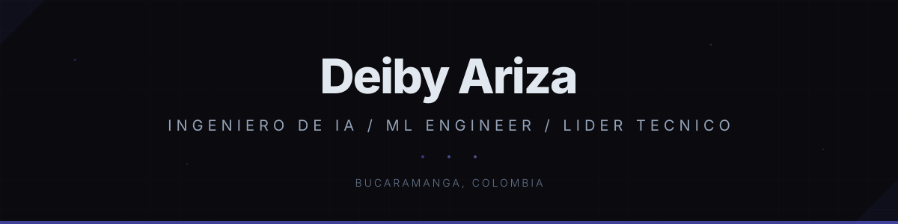
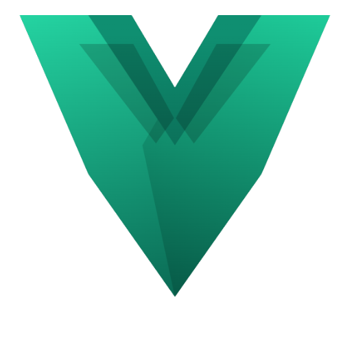

  

  
  

---

Ingeniero electrónico (UIS, acreditada ABET) con +5 años en IA/ML y +10 en tecnología. Construyo sistemas de inteligencia artificial que llegan a producción: plataformas documentales con LLMs en entornos air-gapped sobre GPUs NVIDIA H200, pipelines RAG, modelos de ML entrenados desde cero y productos propios en producción. Lidero equipos técnicos y diseño arquitecturas que escalan.

---

## Productos en producción

<table>
  <tr>
    <td align="center" width="50%">
         
      <a href="https://buholabs.com"><strong>buholabs.com</strong></a> 
      Tu analista para tiendas online: qué campaña te vende, en qué paso pierdes clientes y cuánto dinero se te está yendo, con el video de cada visita. Cada mañana, un correo con lo que conviene arreglar primero.
    </td>
    <td align="center" width="50%">
         
      <a href="https://verboxi.com"><strong>verboxi.com</strong></a> 
      Aprende inglés hablando con una IA que te corrige al instante. Sin clases, sin horarios, a tu ritmo. Vas avanzando con metas y recompensas que te enganchan a practicar todos los días.
    </td>
  </tr>
</table>

---

## Stack tecnológico

**IA / ML** ·

**Plataforma** ·

-326CE5?style=flat&logo=kubernetes&logoColor=white)

---

## Trabajo destacado

### Modelos de ML propios

**Hit Song Predictor**: modelo ensemble (MLP + CNN + XGBoost) entrenado desde cero sobre 83 features de audio extraídas con librosa + espectrogramas mel 128x128 para la CNN. 74.2% de accuracy prediciendo éxito de canciones usando solo audio, sin metadata de Spotify. Desplegado en AWS Lambda con inferencia en tiempo real.

**Sistema de recomendación musical**: modelos entrenados sobre +5M registros de artistas. Indexación de +450,000 perfiles en OpenSearch con búsquedas en menos de 50ms. Endpoints de inferencia en FastAPI en menos de 100ms.

### Sistemas de IA empresariales

**Plataforma de inteligencia documental**: para el sector defensa de Colombia. LLMs locales desplegados on-premise en entornos air-gapped sobre 4x NVIDIA H200 GPUs, pipeline RAG con pgvector, streaming SSE, orquestación en Kubernetes (K3s). Rescate de un sistema de 2.3M documentos en cluster de 6 nodos tras falla catastrófica de almacenamiento, con 99.5% de uptime post-estabilizacion.

**Plataformas de IA gubernamentales**: RAG multi-proveedor (OpenAI, Azure OpenAI, Ollama, vLLM), prototipos para entidades de seguridad, encuestas ISO 9001, gestión interna.

**Scraper de gran escala**: ingesta de +10M registros de +75 emisoras de radio en OpenSearch y S3.

### Mega Pipeline de audio (ConcertPlaza)

Pipeline completo: Whisper transcribe la letra, GPT la mejora con feedback de 3 agentes expertos IA (productor, ingeniero de mezcla, letrista), GPT construye prompt inteligente para Suno usando hit score + diagnóstico + recomendaciones, Suno genera la canción, Demucs separa stems, y se mezclan 2 versiones finales con los instrumentales mejorados. Todo orquestado en una sola Lambda de 15 minutos.

---

## Trayectoria

**BIT512 Soluciones TI** · Líder de IA / Ingeniero Senior de IA *(2025 - presente)* 
10+ proyectos: Eclipse, JANUS, Hydra, Nexus, Sortex, Compensar HCM, plataformas gubernamentales.

**IncubApp Venture Capital** · AI Technical Project Manager *(2024 - 2025)* 
Proyectos de IA para startups del portafolio. 100% de entregas a tiempo.

**IncubApp Venture Capital** · Data Scientist y ML Engineer *(2021 - 2024)* 
Modelos de recomendación, scraping masivo, fine-tuning de LLMs, inferencia ML en producción.

---

## Formación

**Ingeniería Electrónica** · Universidad Industrial de Santander (acreditada ABET) 
**Técnico en Sistemas** · SENA 
AWS Cloud Practitioner · Cisco IoT y Networking · Web App Security

---

  <a href="https://linkedin.com/in/deibyariza">linkedin.com/in/deibyariza</a> ·
  <a href="mailto:deibyarizac@gmail.com">deibyarizac@gmail.com</a> ·
  Bucaramanga, Colombia

